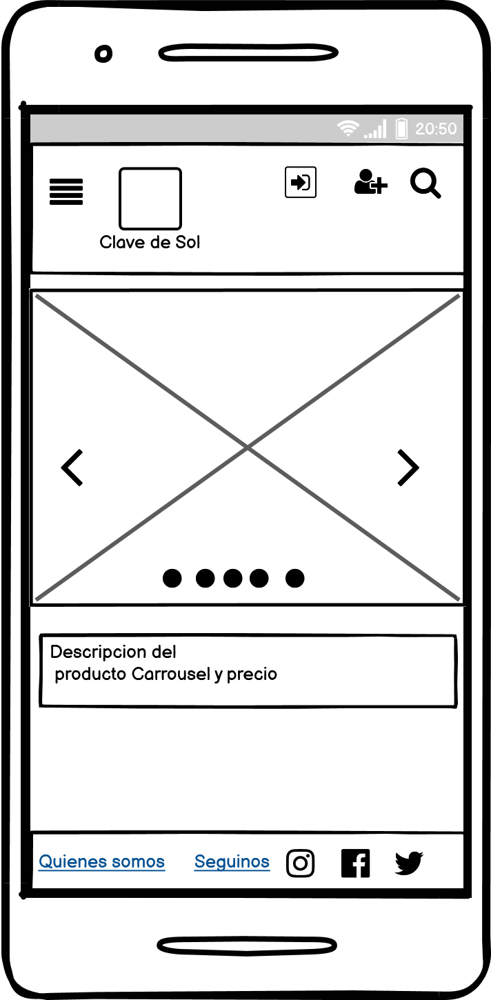
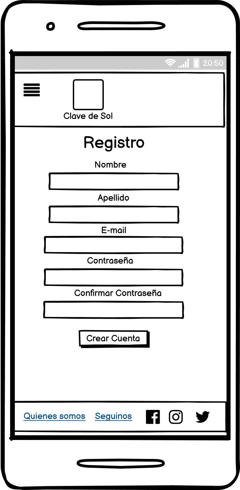
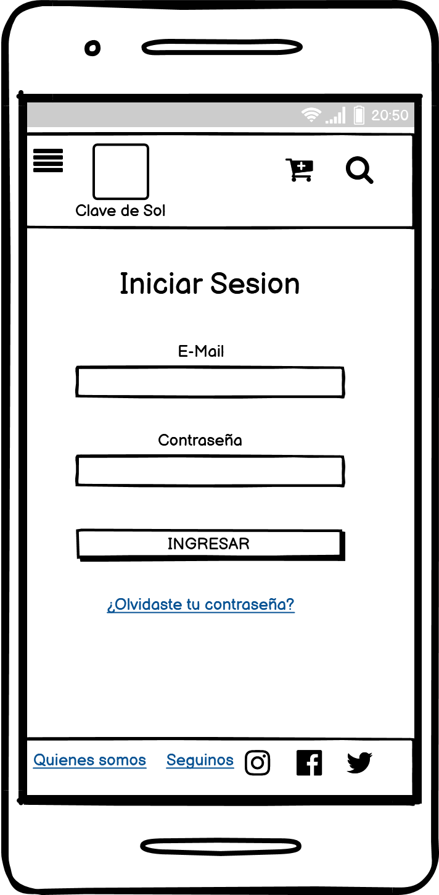
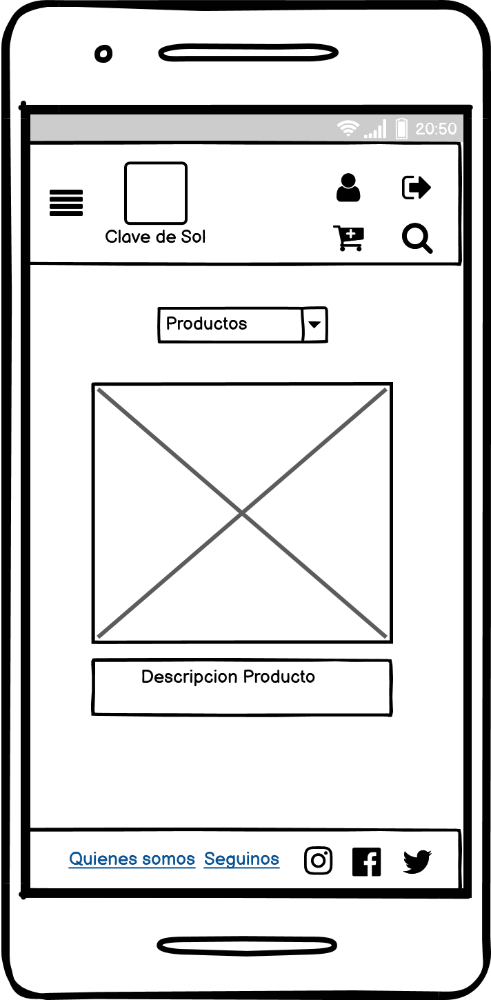
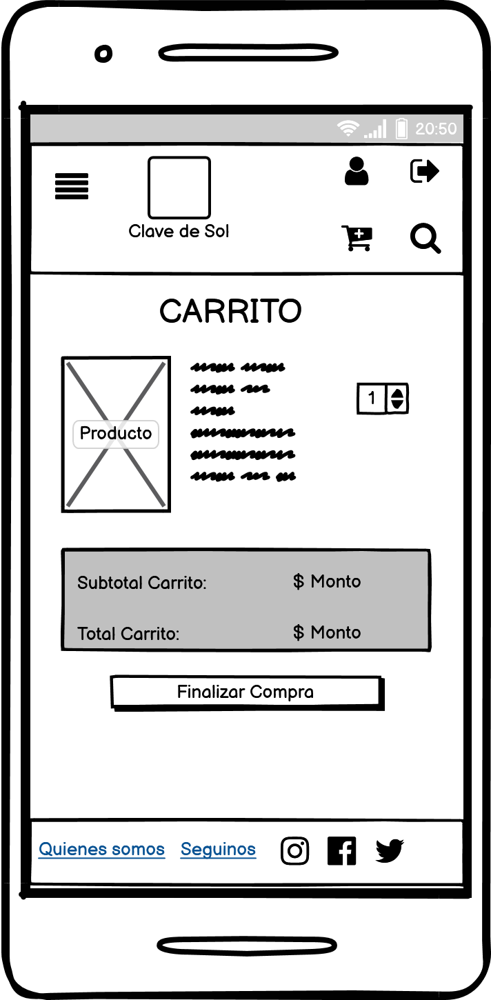

# Ecommerce Musical

## Description:
Vamos a elaborar una tienda de artículos musicales online

## Público Objetivo: 
Las personas podran comprar instrumentos musicales y demás artículos

## Support Team:
Ante cualquier eventaulidad favor contactar a:

- Cristina Navas cris.30a@hotmail.com
- Pablo Ghiguly  ghigu28@yahoo.com.ar
- Oscar Luciani lucianioscar1@gmail.com
- Luis CarrasquillaEmail: <luis.carrasquilla.z@gmail.com>

## Páginas de Referencia
avon.com
a4patastienda.com;
linio.com;
mercadolibre.com;
amazon.com;

## WireFrames Sprint 1

## Roadmap

## License information:  
